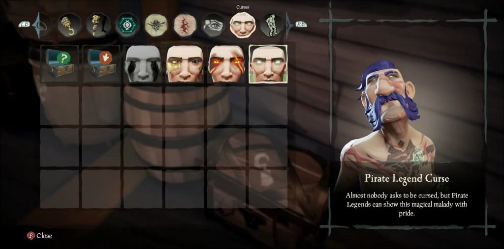
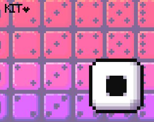
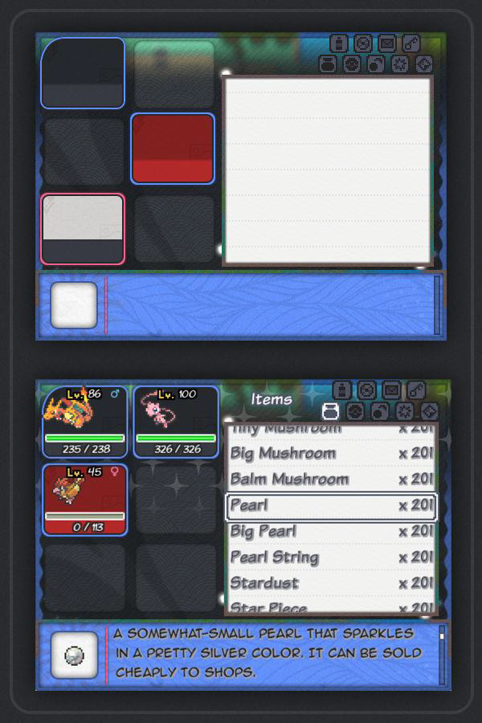
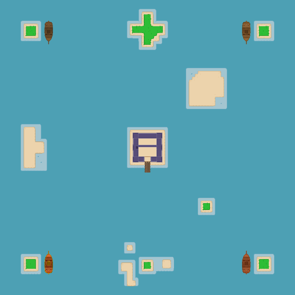

# Game Design Document

  

## Game Summary Pitch

> PyCeas is an opensource project that aims to create a 2D, top down, turn based board game in Pygame. Where players become pirates and control their own ship. Using a card-based dice system, players explore a dynamic map, complete quests, and battle rival pirates.
> 
> Whether you’re a developer, artist, writer, or just curious about game design, there’s a role for everyone on this ship.

The game will be developed in phases, with an initial focus on a small, playable prototype that features core mechanics such as dice rolls, ship upgrades, and map exploration.

---

## Table of Contents
- [Game Design Document](#game-design-document)
  - [Game Summary Pitch](#game-summary-pitch)
  - [Table of Contents](#table-of-contents)
    - [Key Terms](#key-terms)
      - [Board Game Mechanics](#board-game-mechanics)
      - [Game Development Concepts](#game-development-concepts)
      - [User Interface and Interaction](#user-interface-and-interaction)
      - [Community-Driven Development](#community-driven-development)
      - [Gameplay Themes](#gameplay-themes)
  - [Genre](#genre)
  - [Inspiration](#inspiration)
      - [Sea of Thieves](#sea-of-thieves)
      - [Pillars of Eternity 2: Dead Fire](#pillars-of-eternity-2-dead-fire)
      - [Slay the Spire](#slay-the-spire)
  - [Player Experience \& Gameloop](#player-experience--gameloop)
    - [Platform](#platform)
      - [Future Plans](#future-plans)
  - [Development Software](#development-software)
      - [Optional Development Software](#optional-development-software)
  - [Target Audience](#target-audience)
  - [Concept](#concept)
    - [Design and Thematic Pillars](#design-and-thematic-pillars)
  - [Gameplay Overview](#gameplay-overview)
      - [Theme Interpretation (Curse is Strenth)](#theme-interpretation-curse-is-strenth)
    - [Primary Mechanics](#primary-mechanics)
      - [Concept: Dice Roll](#concept-dice-roll)
      - [Concept: Virtual Book](#concept-virtual-book)
      - [Concept: Free Movement](#concept-free-movement)
      - [Concept: Ship Upgrading](#concept-ship-upgrading)
    - [Secondary Mechanics](#secondary-mechanics)
      - [Concept: Fog of War](#concept-fog-of-war)
      - [Concept: Procedural Generation](#concept-procedural-generation)
      - [Concept: World Events](#concept-world-events)
  - [Art and Immersion](#art-and-immersion)
    - [Artistic Pillars](#artistic-pillars)
    - [Design](#design)
      - [Map Design](#map-design)
  - [Audio](#audio)
    - [Dynamic Soundtrack](#dynamic-soundtrack)
    - [Sound Effects](#sound-effects)
  - [Game Experience](#game-experience)
    - [User Interface (UI)](#user-interface-ui)
    - [Controls](#controls)
  - [Developent Timeline](#developent-timeline)
    - [GitHub Projects](#github-projects)
    - [Milestones](#milestones)
  - [Community Philosophy](#community-philosophy)
  - [Communication](#communication)
    - [Discord](#discord)

---

### Key Terms
> Just as a pirate needs a map to navigate the seas, contributors to PyCeas can use this section to navigate the terms and ideas in this document.

#### Board Game Mechanics

- `Turn-Based Gameplay`: A game structure where players take turns performing actions, allowing time for strategic decision-making.
- `Dice Rolls`, see [reference](#concept-dice-roll): A mechanic where random outcomes, like movement or combat results, are determined by rolling dice. In PyCeas, these rolls are influenced by a card-based system.
- `Modular Map`, see [reference](#map-design): A dynamically arranged map composed of tiles, creating unique layouts for each playthrough..

#### Game Development Concepts

- `Procedural Generation`, see [reference](#concept-procedural-generation): A method of creating game content algorithmically rather than manually. In PyCeas, this applies to generating map layouts and resource placements.
- `Fog of War`, see [reference](#concept-fog-of-war): A mechanic that obscures unexplored areas of the map..
- `World Events`, see [reference](#concept-world-events): In-game occurrences triggered by player actions, such as stepping into specific areas or interacting with certain objects. These events add unpredictability and variety.

#### User Interface and Interaction

- `Virtual Book`, see [reference](#concept-virtual-book): A centralized interface inspired by the Pokémon series’ Pokédex, where players manage quests, inventory, and maps seamlessly.
- `Pixel Art`, see [reference](#art): A style of digital art where images are created and displayed at a low resolution, resulting in a retro aesthetic.

#### Community-Driven Development

- `Open-Source Project`: A collaborative development model where the game's code, assets, and design are publicly available for anyone to contribute to or modify.
- `Modularity`: A design approach where features and systems are developed as independent, interchangeable components, allowing flexibility and incremental updates.

#### Gameplay Themes

- `Curses as Strength`, see [reference](#theme-interpretation-curse-is-strenth):Curses act as both benefits and drawbacks, shaping gameplay strategy.
- `Deck-Building Mechanics`, see [reference](#slay-the-spire): A system where players collect and manage a deck of cards that influence gameplay, such as dice rolls and gameplay outcomes.

---

## Genre
1. **Tabletop-Inspired Board Game:**
   PyCeas replicates the feel of classic tabletop games in a digital format. Players interact with modular maps, roll dice, and manage resources in a turn-based structure that emphasizes strategic decision-making.
2. **Exploration-Based Strategy Game:**
   Players navigate procedurally generated maps, uncover hidden tiles, and interact with dynamic events. Strategy lies in balancing exploration, risk, and resource management.
3. **Role-Playing Adventure Game:**
   Narrative-driven quests, player choices, and ship customization bring RPG elements into the game. Players tailor their journey and gameplay style through decisions that change their outcomes.

## Inspiration

#### Sea of Thieves
PyCeas draws inspiration from the immersive exploration and competitive interactions in Sea of Thieves. Initially inspired by the video game's dynamic pirate world, PyCeas also aligns with the tabletop mechanics seen in the official Sea of Thieves board game.

#### Pillars of Eternity 2: Dead Fire
Narrative `choices` and their impact on `outcomes` are central to PyCeas, inspired by RPGs like Pillars of Eternity 2.

#### Slay the Spire

`Deck-building` mechanics and a `dice system` that are inspired by Slay the Spire, adding strategic depth and replayability.

---

## Player Experience & Gameloop

> In PyCeas, each turn feels like a step into the unknown. This section highlights the strategic and immersive gameplay loop that defines the player's journey.

- Players uncover hidden tiles, discover new locations, and trigger narrative-driven quests.
- Unexpected encounters like rival pirates, mysterious islands, or treasure discoveries add variety to gameplay.
- Pursue narrative-driven objectives that offer rewards and shape the story.
- Choices in ship upgrades, curse selection, and dice-based actions allow players to tailor their playstyle.

### Platform

PyCeas will be developed using Pygame-CE, focussing on optimized performance, scalability, and compatibility with older hardware.

#### Future Plans
Future updates aim to introduce multiplayer modes, browser accessibility, and local network connections.

---

## Development Software

- Pygame-CE
- Python 3.12 (or using a virtual environment, see [Readme](/README.md))
- Tiled (map editor) for map creations

#### Optional Development Software
- Aseprite for graphics and UI
- LibreSprite

## Target Audience

> PyCeas is designed for anyone who loves adventure, strategy, and storytelling. Here’s who we’re inviting aboard:

1. **Casual Gamers:**
   PyCeas is accesible to players who want engaging, pirate themed gameplay without a steep learning curve.
2. **Indie Game Fans:**
   Open-source enthusiasts and indie game players will appreciate PyCeas' collaborative development model and unique mechanics.
3. **Age Range:**
   - 12-18: Young players will enjoy the simple gameplay and pirate-themed adventure.
   - 18-70: Adults seeking strategy with replayability will enjoy PyCeas'depth and customization options.

---

## Concept

### Design and Thematic Pillars

> These pillars act as the foundation of PyCeas—a treasure map guiding the team toward a shared vision.

1. **Exploration and Discovery:**
   Players reveal hidden treasures, quests, and dynamic events as they explore the modular map. Each playtrough offers new challenges to maintain replayabilty.
2. **Strategic Depth:**
   Dice-based randomness is balanced with tactical decisions, allowing players to influence outcomes using cards, upgrades etc.
3. **Player Agency:**
   Players customize their ships, choose curses, and make narrative choices that effect their outcomes.
4. **Immersion in a Pirate World:**
   PyCeas uses vibrant pixel art, thematic audio, and interactive NPC interactions to bring the world of PyCeas to life.
5. **Community-Driven Development:**
   Encoures flexibility and collaboration by building the game as an open-source project, shaped by community feedback and contributions.

---

## Gameplay Overview

| Gameplay Loop |  Players control a customizable ship, exploring a dynamic, modular map. They roll dice to navigate, engage in naval combat, and complete quests. Each decision shapes their journey, offering replayability and strategic depth. |
|-------------------------------------|------------------------------------------------------------------------------------------------------------------------------------------------------------------|

#### Theme Interpretation (Curse is Strenth)

  

In PyCeas, curses are not just cosmetic effects; they serve as gameplay modifiers that add strategic depth and variety to the player's experience. Drawing inspiration from role-playing games like Pillars of Eternity 2, curses act as status effects that influences how players interact with the world, engage in combat, and make decisions.

- At the start of the game, players choose one of several available curses.
- Each curse introduces unique advantages and disadvantages, shaping the player's interactions with NPCs, quest outcomes, and dice rolls.
- Curses offer replayability by providing new challenges and oppurtunities in each playthrough.

**Example Curses:**
- **Cursed Luck:** Lower dice rolls but increased treasure rewards.
- **Burning Ambition:** Resource penalties but combat bonuses.
- **Whispering Shadows:** Distrustful NPCs but avoidance of some hostile encounters.

---

### Primary Mechanics

| Mechanic              | Description                                                                | Animated mock-up (Art not necessarily final)                 |
|-----------------------|----------------------------------------------------------------------------|----------------------------------|
| **Dice Roll**         | Players move based on the number rolled on the dice.                       |  |
| **Virtual Book**      | A virtual book serves as inventory, quest log, and more.                   | |
| **Free Movement**     | Players can move freely across the board during their turn.                | |
| **Ship Upgrading**    | Players start with a basic ship and upgrade it over time to enhance movement, combat, and exploration, tailoring gameplay to their strategy. |  |

---

#### Concept: Dice Roll

Players could use a deck-building-inspired system to influence dice rolls, allowing for strategic decision-making alongside traditional randomness.
*Example:*
1. At the start of a turn, the player draws a dice card:
> "Roll a D8. Gain +2 movement if the result is an even number."
2. The player rolls the dice, lands a 6, and moves 8 spaces (6 + 2). The bonus triggers a hidden event, revealing a nearby NPC.

#### Concept: Virtual Book

The `Virtual Book` could act as a centralized interface for inventory, quest logs, and maps. Inspired by the Pokédex in the Pokémon series, it would provide an intuitive and seamless way for players to manage resources and track progress.

*Example Features:*
> - A page for active quests.
> - A map with uncovered tiles.
> - A list of items and ship upgrades.

#### Concept: Free Movement

During their turn, players might have the freedom to move their ship across a modular map based on dice rolls. This system could enable flexible exploration, allowing players to uncover tiles dynamically and adapt their strategy based on the environment.

#### Concept: Ship Upgrading

Players might start with a basic ship and gain the ability to upgrade it over time. Upgrades could provide bonuses in movement, combat, or resource management, tailored to the player’s preferred playstyle.

*Example:*
> Upgrading to a larger ship could grant access to new dice cards, faster movement, or increased inventory space.

### Secondary Mechanics

| Mechanic              | Description                                                                | Animated mock-up (Art not necessarily final)                                             |
|-----------------------|----------------------------------------------------------------------------|--------------------------------------------------------------|
| **Fog of War**        | Limits visibility on the map, encouraging strategic exploration.                    |  |
| **Procedural Generation** | Randomized map layouts to ensure unique challenges and enhance replayability.                       |  |
| **World Events**      | Dynamic encounters triggered by stepping into specific map zones, similar to Pokémon’s "tall grass" mechanic.                                |  |

---

#### Concept: Fog of War

A `Fog of War` system could limit the visibility on the map, requiring players to uncover tiles as they explore. This mechanic would add a sense of mystery and strategic decision-making.
*Example Implementation:*
> Initially, all tiles are hidden under a semi-transparent layer. Players reveal adjecent tiles dynamically as they move, uncovering hidden treasures, NPCs, or hazards.

#### Concept: Procedural Generation

The map layout and resources could be `Procedurally Generated` for each playtrough, offering unique challenges and environments. This would enhance replayability by ensuring no two games are the same.
*Example Implementation:*

> Key features like ports, hazards, and treasures could follow predefined rules to maintain balance while introducing randomization for variety.

#### Concept: World Events

Dynamic `World Events` could be triggered similarly to how encounters occur in classic Pokémon games when players interact with "tall grass" or specific terrain types. These events add unpredictability and immersion as players explore the map.

*Example Implementation:*

> Stepping on a specific tile could trigger an event like a rival pirate attack, a stranded merchant, or an island discovery quest.

---

## Art and Immersion

### Artistic Pillars

> These pillars define PyCeas' artistic identity, focusing on the visual style and how it complements gameplay and storytelling.

1. **Dynamic Color Shifts:**
   Gameplay elements influence the environment, altering color tones to reflect changes in mood, state, or reactions. For instance:
   - A cursed area may have darker, muted tones.
   - A succesful exploration may brighten the surrounding map.
2. **Player Immersion:**
   As players interact with the environment, the dynamic visuals enhance immersion and reinforce the thematic storytelling.

3. **Interactive Environments:**
   Visual details like rippling water, flickering lanterns, or shifting shadows bring the world to life. These subtle elements respond dynamically to player actions, enhancing immersion.
4. **Clarity Through Design:**
   Clear, minimalistic visuals ensure that the game's aesthetic doesn’t compromise functionality. Every pixel serves a purpose, balancing beauty with usability.

### Design

> PyCeas’ design philosophy prioritizes flexibility, collaboration, and usability. Its open-source foundation invites contributors to leave their mark on the project, ensuring a game shaped by creativity and community.

1. **Minimalism with Purpose:**
Visuals and mechanics are kept simple to enhance usability while still delivering a rich, immersive experience.

2. **Collaboration-First Approach:**
The modular design allows contributors to work on independent features (e.g., adding curses, creating new tile sets) without disrupting existing systems.

3. **Flexible Aesthetics:**
While the base art style is pixelated, contributors can experiment with complementary visual elements, such as animations or overlays, to enhance gameplay.

#### Map Design

The map will feature a modular, tile-based design created with Tiled, using 16x16 pixel assets. To optimize performance, the game will be employ chunk-based rendering, displaying only the tiles near the player (e.g. a 10x10 or 15x15 visible area). This approach allows for larger maps without performance degradation.

For the project we’ve created an initial 100x100 tile-based map using 
Tiled, providing a foundational layout for exploration and gameplay. As development progresses, this map can be expanded or modified based on gameplay needs and **community feedback**.

---

## Audio

### Dynamic Soundtrack

> Help make the seas sing! PyCeas needs an adaptive soundtrack that mirrors the journey of a pirate. Composers and sound designers can craft melodies for every mood, from calm exploration to thrilling naval battles. Imagine the possibilities:
>
> - A haunting theme for cursed areas
> - Uplifting tones for discoveries and victories.
> - The rumble of cannons during battles!

<!-- A dynamic and adaptive soundtrack will accompany players as they explore the map. The music will shift in tone and intensify depending on the player’s actions and the environment, from calm and mysterious melodies while exploring uncharted waters, to intense rhythms during 
combat. -->

### Sound Effects

To enhance the experience and add polish, a variety of environmental sound effects will provide feedback and depth to the player’s actions. These sounds will be integrated throughout the game, including when using the inventory, world map, menus, settings, and more.

Initially, the game will include a limited set of key sound effects, such as dice rolls, ship movement, and cannon fire. Dynamic or adaptive soundtracks will be introduced in later development stages, using Pygame's `mixer` module for basic audio handling.

---

## Game Experience

### User Interface (UI)

The User Interface (UI) is a central mechanic in the game, designed to track all aspects of the player’s progress, including the quest log, items storage, and other key elements. The UI will be easy to use and accessible, providing players with a clear view of their in-game 
activities and resources.

The User Interface (UI) will be designed modularly, allowing incremental updates as features are implemented. Initial versions will include only core elements, such as dice rolls, movement, and basic ship management.

### Controls

The controls will include both mouse and keyboard inputs, with shortcuts for common actions such as rolling dice, interacting with the map, or accessing the inventory.

**Mouse:**
- Left click: primary interaction method for navigating the UI and 
interacting with game elements.

**Keyboard:**
- Special keys: for interacting with the map, accessing the inventory 
or instantly focussing on the player. 

---

## Developent Timeline

### GitHub Projects

We aim to use Github projects to manage the development timeline and roadmap for the game future features, updates, and milestones. It will be organized and tracked through our [Project Task List](https://github.com/users/ultimateownsz/projects/15), with new features and tasks being created via issues. This approach allows for transparent progress tracking, collaborative development, and ensures that the  community can easily follow and contribute to the project.

### Milestones
The development will follow a phased roadmap:
- **Phase 1:** Core mechanics (dice rolls, ship movement, ship upgrades)
- **Phase 2:** Dynamic events, additional quests, and audio enhancements.

---

## Community Philosophy

> At PyCeas, we know that the best pirate crews come from all walks of life. Whether you’re a coder, artist, storyteller, or someone with a passion for testing and feedback, your skills are welcome here! This project thrives on collaboration, and every crewmember has a part to play in shaping our shared vision.

**Core Principles:**

- **Modularity:**
  Features are built incrementally, allowing contributors to focus on specific aspects (e.g., a new curse, ship upgrades).
- **Inclusivity:**
  PyCeas is open to contributors of all skill levels, from beginners learning Python or game design to seasoned developers, artists, or storytellers.
- **Transparency:**
  All development progress is tracked on GitHub, with contributors credited for their work. Every contributor is credited, fostering a sense of ownership and regognition.

**Community Goals:**
PyCeas is designed to evolve with community input, adding features like:

- **Multiplayer modes:** cooperative and competitive.
- **New curses** & **status effects**.
- **Expanded Quests and Content:** Enriching the game world with procedurally generated and handcrafted elements.
- **Improved Accessibility:** Enhancing inclusivity with scalable UI and localization efforts. 

---

## Communication

### Discord

For communication among contributors, we use our [Discord Server](https://discord.gg/MZ5MHqDnGW). This helps us to stay transparent with progress tracking, reporting on feedback and actively involve the community in the project.
